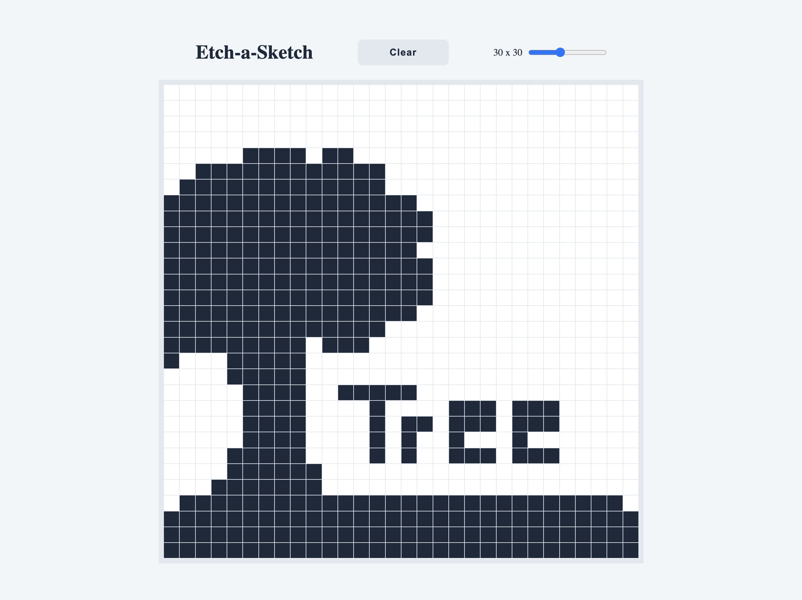
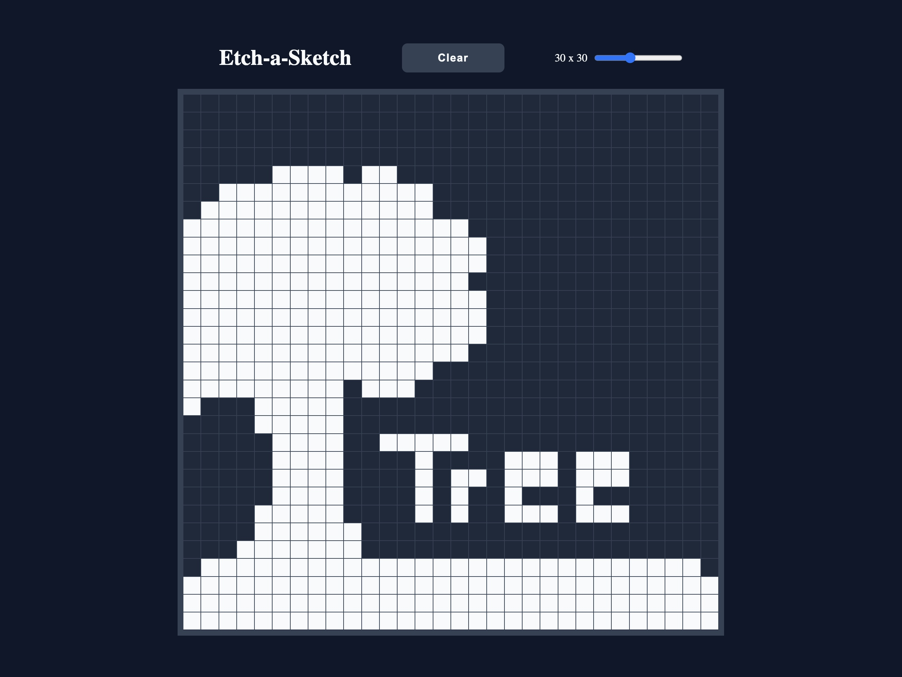

# Etch-a-Sketch

A browser-based sketchpad that allows users to draw on a digital canvas by clicking and dragging. 

---

## Visual Demonstration

| Light Mode | Dark Mode |
| :--- | :--- |
| |  |

## Features

* **Click-to-Draw**
* **Dynamic Grid Sizing:** adjust the canvas resolution anywhere from 8x8 up to 64x64 using the slider. 
* **Native Dark Mode:** automatically detects and applies your system's light or dark mode prefrences using CSS `prefers-color-scheme`.
* **Instant Reset:** clear the canvas without refreshing the page. 

---

## How to Run Locally 

1. Clone this repository to your local machine.
2. Navigate to the project directory. 
3. Open the `index.html` file in any modern web browser.
